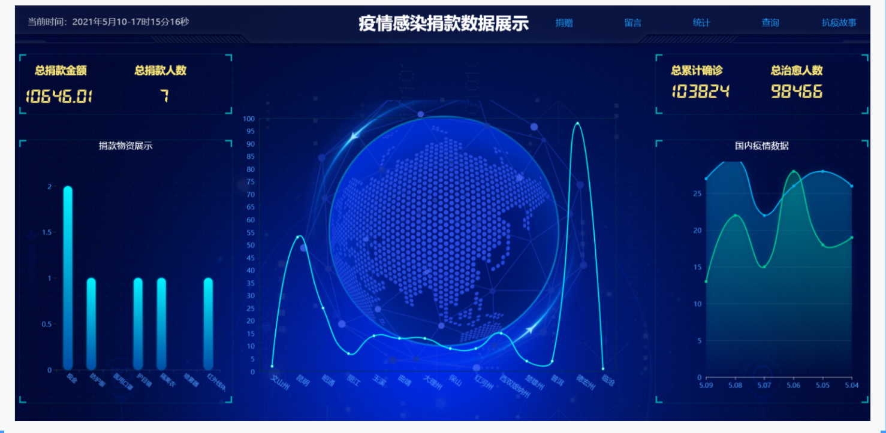
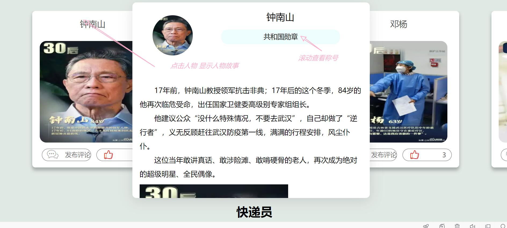
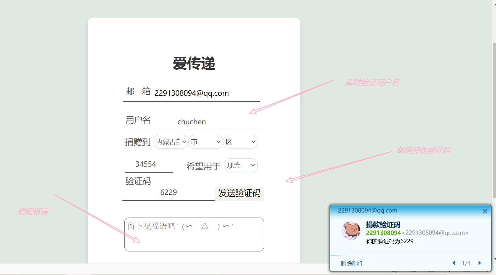
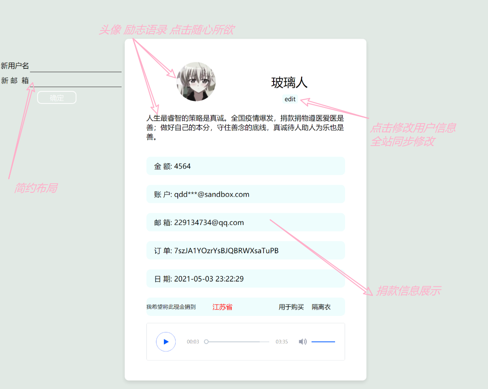
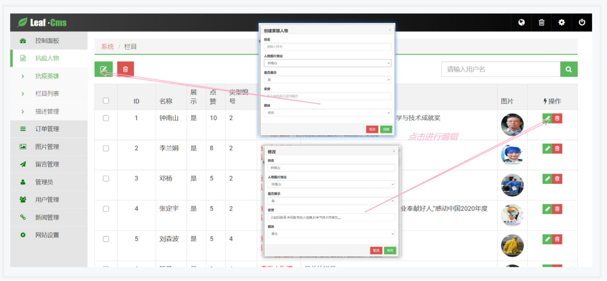
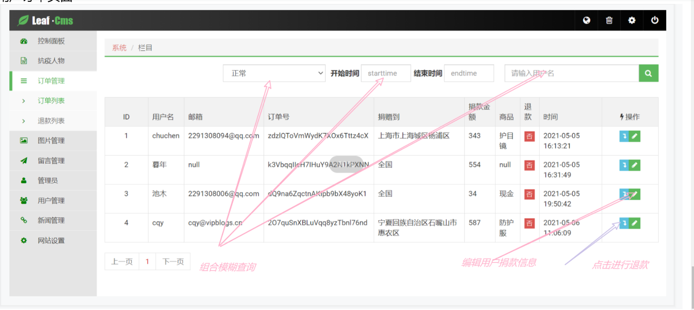

# 简介
该系统是一个疫情捐款系统，采用前后端分离的方式，前端使用echarts作为数据展示，能够实时显示疫情数据，用户捐款数据、
已经接入支付宝支付功能，并且在后台能够进行订单查询，退款等操作
后台操作有：
- 用户管理
- 订单管理
- 文件上传管理
- 评论管理
- 留言管理
- 新闻管理
- 抗疫人物管理

该项目也部署到服务器，如果感兴趣的话，可以访问下面网址进行查看
- 后台管理<a href="http://admin.vipblogs.cn/index.html">点击访问</a>
- 前台页面<a href="http://yq.vipblogs.cn/">点击访问</a>

# 效果展示
## 首页
首页的设计，主要集图表为主，图表能够更直观的反应用户捐款数据，国内疫情变化情况

## 抗疫英雄留言，点赞

## 疫情实时播报，留言

## 捐款字段

## 用户个人捐款页面

## 后台首页

## 修改抗疫英雄人物信息

## 用户订单页面

# 接口

接口文档，请查看`接口.md`文件
